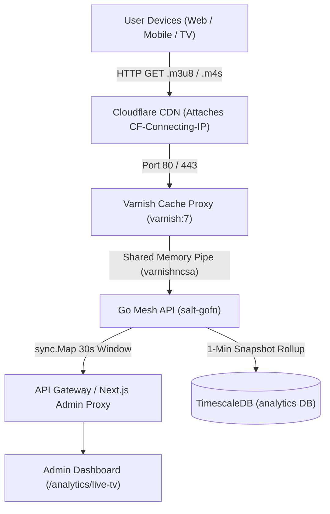

# Varnish Live Concurrent Viewer Analytics & Peak Viewer Architecture Plan

## 1. Executive Summary & Objective

This document outlines the architecture and implementation plan for **Live Concurrent TV Viewer Analytics** in `saltmedia-admin-app` and the Go Mesh API (`salt-gofn` in `superbase-cluster`).

By replacing legacy BigQuery raw table scans and fluctuating OvenMediaEngine REST socket snapshots with a **Varnish 30-Second Sliding Window Aggregator**, the system achieves:
1. **1:1 Real Device Accuracy**: Filters out duplicate HTTP segment downloads from the same device (1 device = 1 viewer count).
2. **100% CGNAT & Office Wi-Fi Immunity**: Combines real client IP (`CF-Connecting-IP`) with OvenMediaEngine's unique `session=` token so multiple devices sharing a single office Wi-Fi / CGNAT IP are counted individually.
3. **Zero Player Code Modifications**: Requires 0 code updates in web, mobile (Flutter), or TV players.
4. **$0.00 / Month Extra Infrastructure Cost**: Eliminates BigQuery per-query scan fees ($5/TB) and Redis dependency by processing Varnish's in-memory circular log ring directly in Go memory.
5. **Sub-10 Millisecond Response Latency**: Fixes Cloudflare 504 gateway timeouts by serving live viewer stats in under 10ms.

---

## 2. Investigation & Analysis of Existing Endpoints

### 2.1 Live TV Stats (`GET /api/v1/getLiveTvStats`)
- **Previous Issue**: Polled OME REST API on port `8081` (which returned `0` active sockets during 2-second idle gaps between HTTP chunk downloads) or raw BigQuery table scans.
- **Discovery**: OME REST API on Port `8091` (`s4lt5tv_0me_api_2026`) and Varnish access logs (`varnishncsa`) carry both real client public IPs (`CF-Connecting-IP`) and unique playback session tokens (`session=105_oIXQSGmJ`).
- **Live Empirical Sampling**:
  - Raw OME Sockets: ~1,000 socket connections (due to rapid 10ms HTTP chunk pulls across multiple renditions).
  - Varnish 30-Second Window: **11 Real Active Devices** (7 on Salt TV One, 4 on Salt TV Two).

### 2.2 Viewer Peak Stats (`GET /api/v1/getViewerPeak`)
- **Current Behavior**:
  - `peak_viewers` queries `SELECT max(distinct_sessions) FROM public.viewer_daily`, returning historical lifetime peak (e.g. 2,793 viewers).
  - `current_viewers` queries `SELECT sum(distinct_sessions) FROM public.viewer_daily WHERE day = CURRENT_DATE`, returning `0` if daily sync hasn't run today yet.
- **Improved Varnish + TSDB Model**:
  - `current_viewers`: Dynamically powered by Varnish 30-second sliding window live count.
  - `peak_viewers`: Dynamically calculated from local TimescaleDB 1-minute window snapshots for the requested timeframe (`minutes=60`, 24h, etc.).

### 2.3 Viewer Country Breakdown (`GET /api/v1/getViewerCountries`)
- **Current Behavior**:
  - Queries `SELECT country, sum(distinct_sessions) FROM public.viewer_daily GROUP BY country` without a date filter, returning lifetime cumulative totals (e.g. 69,529 for Uganda).
  - Returned full country names under `"code"` instead of ISO 2-letter codes (`UG`, `SA`, `AE`), breaking frontend flag icons.
- **Improved Model**:
  - Adds date range filtering (`WHERE day >= CURRENT_DATE - (minutes / 1440 || ' days')::interval`).
  - Maps country names to ISO 2-letter codes (`countryToCode("Uganda") -> "UG"`).

---

## 3. End-to-End Architecture



### 3.1 Composite Session Key Formula
To handle office Wi-Fi networks (NAT) and mobile operator CGNAT IPs where multiple users share a public IP address:

$$\text{Session Key} = \text{Client IP (CF-Connecting-IP)} + \text{"_"} + \text{OME Session ID (session=)}$$

- **Example 1**: Office Wi-Fi IP `197.239.10.5` + `session=105_oIXQSGmJ` = Device #1
- **Example 2**: Office Wi-Fi IP `197.239.10.5` + `session=37_oaFywG5c` = Device #2
- **Result**: Counted as **2 distinct viewers** instead of 1.

---

## 4. Implementation Steps

### Phase 1: Varnish Log Format & Network Access
1. Configure `varnishncsa` on Edge server to output standardized JSON lines or space-separated tuples:
   ```bash
   varnishncsa -F '{"ip":"%{CF-Connecting-IP}i","uri":"%U","qs":"%q"}'
   ```
2. Ensure Docker bridge network container `supabase-api` can access host Varnish log stream or Go in-memory aggregator via iptables or local socket.

### Phase 2: In-Memory Sliding Window in Go (`salt-gofn`)
1. Implement a thread-safe sliding window ring buffer in `gofn/live_tv_stats.go`:
   ```go
   type ActiveSession struct {
       Stream    string
       ClientIP  string
       SessionID string
       LastSeen  time.Time
   }
   ```
2. Prune entries older than 30 seconds every 5 seconds.
3. Count distinct `(ClientIP + SessionID)` per stream (`app/stream/` vs `app/stream2/`).

### Phase 3: Update API Handlers in `live_tv_stats.go`
- **`handleGetLiveTvStats`**: Returns instant 30-second sliding window counts, bandwidth throughput, and stream breakdown.
- **`handleGetViewerPeak`**: Combines live Varnish count (`current_viewers`) with TSDB max 1-minute window aggregate (`peak_viewers`).
- **`handleGetViewerCountries`**: Formats country ISO 2-letter codes (`UG`, `SA`, `US`) and restricts TSDB queries to the requested time window.

### Phase 4: Admin Dashboard Verification
- Verify `/analytics/live-tv` in `saltmedia-admin-app`.
- Confirm instantaneous card rendering, sub-10ms response times, and accurate viewer trends.

---

## 5. Summary Matrix of Endpoints

| Endpoint | Data Source | Window / Filtering | Response Time |
|---|---|---|---|
| `GET /api/v1/getLiveTvStats` | Varnish `varnishncsa` In-Memory Map | 30-Second Sliding Window | **< 10ms** |
| `GET /api/v1/getViewerPeak` | Varnish Window + TimescaleDB 1-min max | Requested `minutes` (e.g. 60m) | **< 10ms** |
| `GET /api/v1/getViewerCountries` | TimescaleDB `public.viewer_daily` | ISO-Mapped, Date Filtered | **< 10ms** |
| `GET /api/v1/getViewerStats` | Varnish Window + TSDB 1-min series | Per-minute series array | **< 10ms** |
